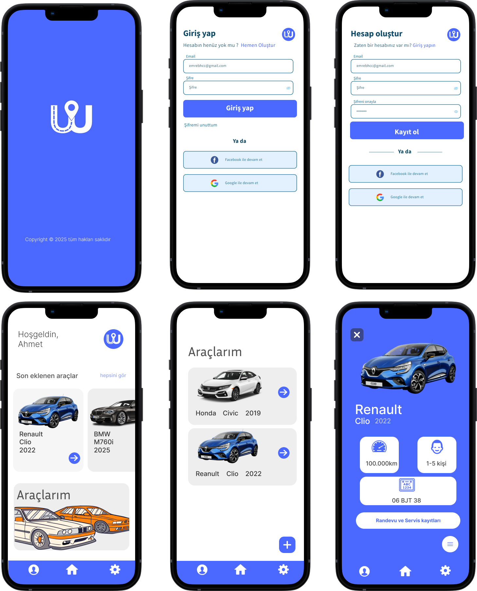

# 🚗 Araç Takip Uygulaması

Bu proje, araç sahiplerinin araçlarına dair servis geçmişini görüntüleyebileceği ve servis randevusu alabileceği uçtan uca bir mobil uygulamadır. Modern bir kullanıcı arayüzü ile Flutter kullanılarak geliştirilmiş olup, Firebase servisleriyle entegre backend mimarisine sahiptir.



---

---

## 🎥 Uygulama Tanıtım Videosu
 [Google Drive Tanıtım Videosu](https://drive.google.com/file/d/1i4v0pnB47gqXTzbzb6HZHPV-oPw49HXl/view?usp=sharing)

---


## 📌 Proje Amacı

Bu projenin temel amacı:

- Flutter kullanarak kullanıcı dostu bir mobil uygulama arayüzü geliştirmek
- Firebase servisleri ile kullanıcı kimlik doğrulaması, veri yönetimi ve sunucu tarafı işlemleri gerçekleştirmek
- Adayın veritabanı modelleme ve uçtan uca çözüm geliştirme yetkinliklerini test etmek

---

## 🛠️ Teknoloji Yığını

| Katman | Teknoloji |
|--------|-----------|
| Frontend | Flutter |
| Backend | Firebase Functions (Node.js / TypeScript) |
| Veritabanı | Cloud Firestore (NoSQL) |
| Kimlik Doğrulama | Firebase Authentication |
| UI/UX Tasarım | Figma |
| State Management | Provider |

---

## 📱 Uygulama Senaryosu ve Özellikler

Kullanıcıların uygulama üzerinden gerçekleştirebileceği başlıca işlemler:

### 1. 👤 Kullanıcı Yönetimi
- E-posta ve şifre ile kayıt olma
- Mevcut kullanıcı ile giriş yapma

### 2. 🚘 Araç Ekleme ve Listeleme
- Plaka, Marka, Model, Yıl ve KM bilgileriyle araç ekleyebilme
- "Araçlarım" ekranında araç listesini görüntüleme

### 3. 🧾 Bakım Geçmişi
- Araç detay ekranından önceki bakım kayıtlarını görüntüleme
- Manuel olarak yeni bakım kaydı ekleme (örneğin: "Yağ değişimi yapıldı")

### 4. 🛠️ Servis Randevusu Alma
- Belirli bir tarih ve saat seçerek servis randevusu oluşturma
- Not: Uygulamada sadece **tek bir servis merkezi** varsayılmaktadır.

---

## 📂 Proje Yapısı (Genel Bakış)

```bash
/backend
 ├── functions/
 │   └── node_modules/
 │   └── routes/
 │   └── utils/
 │   └── .eslintc.js
 │   └── .eslintc.js
 │   └── index.js
 │   └── package-lock.json
 │   └── package.json
 ├── .firebaserc
 ├── .gitignore
 └── firebase.json/


/frontend
    /lib
        ├── main.dart
        ├── model/
        │   └── appointment.dart
        │   └── auth.dart
        │   └── car.dart
        │   └── service_record.dart
        │         
        ├── services/
        │   ├── auth_services.dart
        │   └── car_services.dart
        │   └── appointment_service.dart
        │   └── service_record_services.dart
        ├── pages/
        ├── ├──auth
        ├──     ├──login.dart
        ├──     ├──signup.dart
        │   ├── car_detail_page.dart
        │   ├── home_page.dart
        │   ├── main_page.dart
        │   └── my_cars.dart
        │   └── splash_screen.dart
        │   └── settings.dart
        │   └── profile.dart
        └── widgets/

bash 
```
---
